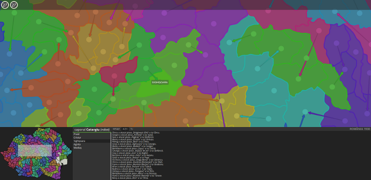

# 1930

1930 is a multiplayer quiz game (similar to ConQUIZtador), but more massive,
urgent, and eternal.

This is the prealpha version so I'm not running it yet on my web site.

## Running it: the shortest version

You need Java and Python installed.

Build it:

    python build.py

Run the WebSocket server:

    java -jar build/server/server.jar

Start the HTTP server:

    cd build/client
    python -m SimpleHTTPServer 7777

On Unix systems run this to start everything for testing purposes:

    ./run.sh

Now go to [localhost:7777](http://localhost:7777).

## Requirements

You need:

* Java installed to run the WebSockets game server.
* Python to run the build scripts.
* A HTTP server to serve the client files. This is optional, you can use Python
instead.

## Configuration

The configuration file is `config.json`. You might want to change:

* **websocketAddress**: Where you run the java websocket server. Leave to
`localhost` for yourself.
* **websocketPort**: The port for it.
* **copyHttpFilesTo**: This is the location where your webserver will serve the
files. If `null`, the files will be just in `build/http-files`.

Build the WebSocket server and construct the HTTP files. Run:

    python build.py

There are 3 HTTP files build modes:

* **separate** (default): Include all the JavaScript files separately.
* **simple**: Join the files into one and perform simple optimizations with
Google Closure.
* **advanced**: The same with advanced optimizations. Sadly this doesn't work
now.

## Data files

### Map

The map data is in `data/map.json`. This includes the SVG paths for the
territories, their neighbors, names, etc.

I'll probably add other countries (real or otherwise) in the future.

### Questions

I'm not sure if I can make my question data files public so I don't include them
here. I will give them to you if you ask me privately.

The question files are `data/four-answers` and `data/number-answers`. They are
in a simple text format and only contain two bogus questions there.

## Running

Start the WebSocket server:

    java -jar build/server.jar

Check the HTTP server. If you don't have one running just use Python for
testing. Run:

    cd build/http-files
    python -m SimpleHTTPServer 7777

and then go to [localhost:7777](http://localhost:7777).

## License

MIT
